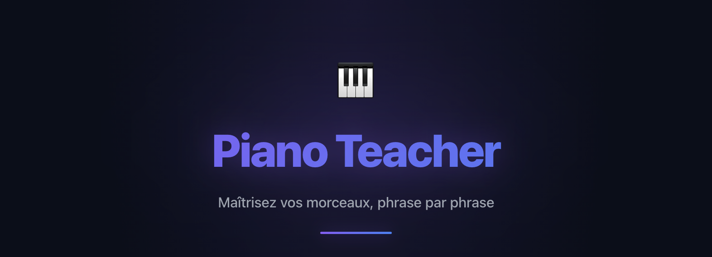
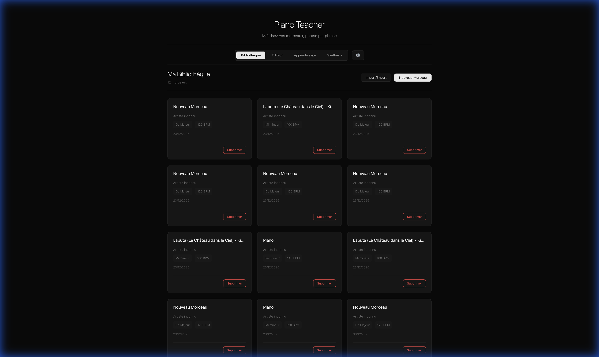
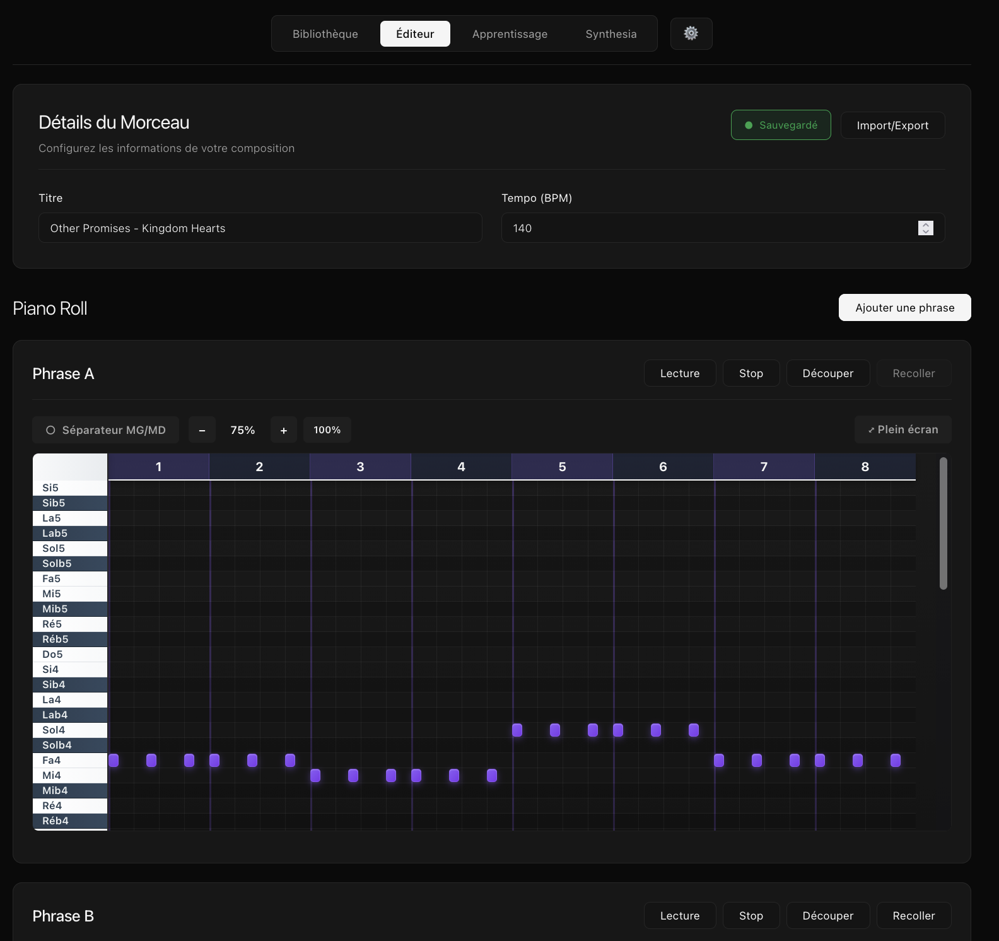
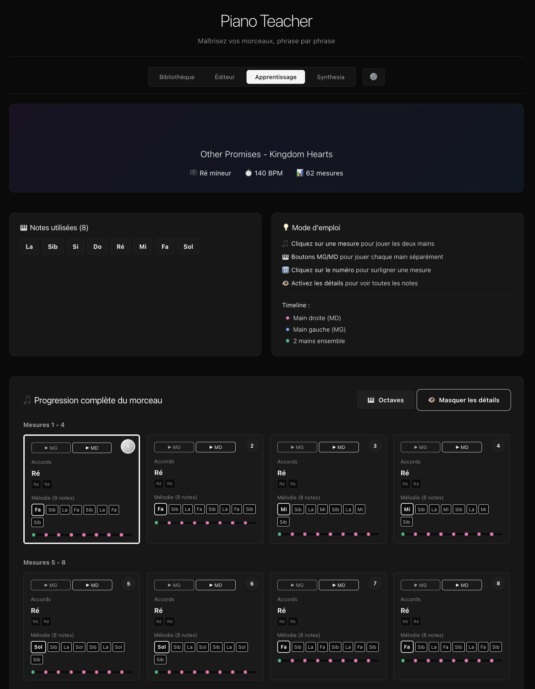
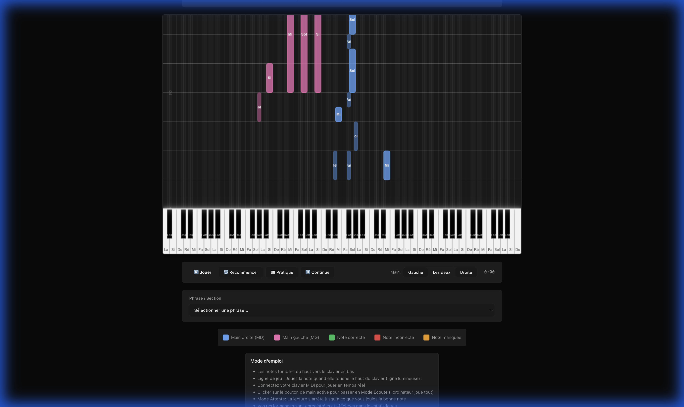

# 🎹 Piano Teacher

<p align="center">
  
</p>

**Piano Teacher** est une application web et desktop interactive conçue pour transformer l'apprentissage du piano. En transformant vos fichiers MIDI en outils pédagogiques visuels, elle vous permet de maîtriser vos morceaux préférés mesure par mesure, avec une précision professionnelle.

---

## ✨ Fonctionnalités Clés

### 📚 Bibliothèque Intelligente (Dashboard)
Gérez votre répertoire avec style. L'interface **Glassmorphism** affiche instantanément les métadonnées cruciales de vos morceaux : tonalité, tempo, et complexité.
> 

### ✏️ Éditeur de Partition (Piano Roll)
Importez vos fichiers `.mid` et laissez l'algorithme faire le travail.
- **Séparation MG/MD** : Identification automatique de la main gauche et de la main droite.
- **Découpage en Phrases** : Organisez votre morceau en sections logiques (Intro, Refrain, Pont).
- **Édition Intuitive** : Ajustez les notes directement sur la grille.
> 

### 📖 Apprentissage par Mesure (Vue d'Ensemble)
Ne soyez plus submergé par la complexité. Travaillez chaque mesure individuellement.
- **Analyse Harmonique** : Détection automatique des accords.
- **Focus Mains Libres** : Choisissez de travailler uniquement la main gauche, la droite, ou les deux.
- **Progression Visuelle** : Marquez vos mesures "en cours" ou "maîtrisées".
> 

### 🎮 Mode Synthesia Interactif
Plongez dans l'action avec une visualisation moderne des notes tombantes.
- **Code Couleur Dynamique** : Rose pour la main gauche, bleu pour la main droite.
- **Gestion du Tempo** : Apprenez à votre rythme en ralentissant la lecture.
- **Statistiques de Performance** : Suivez votre précision en temps réel.
> 

---

## 🚀 Installation & Lancement

### 📥 Téléchargement Exécutable
La solution la plus simple pour Windows, macOS et Linux.
👉 **[Télécharger la dernière version](https://github.com/TobieTheUnknown/Piano/releases/latest)**

### 🛠️ Installation depuis les sources
Pour les développeurs et passionnés :

```bash
# 1. Cloner le projet
git clone https://github.com/TobieTheUnknown/Piano.git
cd Piano

# 2. Installer les dépendances
npm install

# 3. Lancer en local
npm run dev
```
L'application sera disponible sur `http://localhost:5173`.

---

## 🏗️ Architecture Technique

- **Frontend** : [React 19](https://react.dev/) + [Vite](https://vitejs.dev/)
- **Audio Engine** : [Tone.js](https://tonejs.github.io/) pour la synthèse sonore haute fidélité.
- **MIDI Parsing** : [@tonejs/midi](https://github.com/Tonejs/Midi) avec algorithme propriétaire de détection de tonalité.
- **Desktop Wrapper** : [Tauri](https://tauri.app/) pour des performances natives légères.
- **Persistence** : LocalStorage API pour une confidentialité totale (aucune donnée ne quitte votre machine).

---

## 🗺️ Roadmap v2.0
- [ ] Support des claviers MIDI USB (Web MIDI API).
- [ ] Export de partitions en format PDF.
- [ ] Import direct depuis YouTube (Audio-to-MIDI).

---

## 🤝 Contribuer
Les Pull Requests sont les bienvenues ! N'hésitez pas à ouvrir une Issue pour discuter de nouvelles fonctionnalités.

---

## 👤 Auteur
**TobieTheUnknown**  
- GitHub : [@TobieTheUnknown](https://github.com/TobieTheUnknown)

---

## Remerciements
- **Jotabe** pour ses cours de piano et son enthousiasme : [@Jotabe](https://www.twitch.tv/jotabemusique)
<p align="center">
  Fait avec ❤️ pour les passionnés de musique. 🎵
</p>
