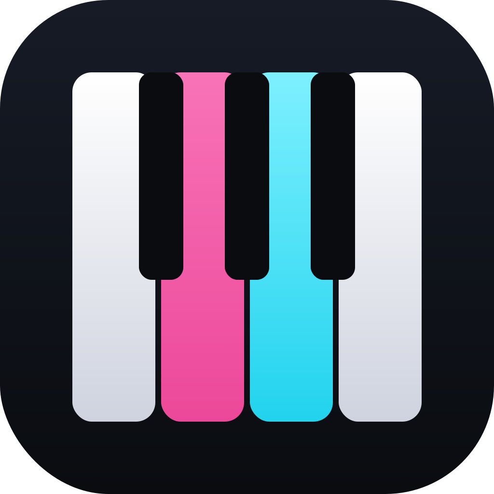
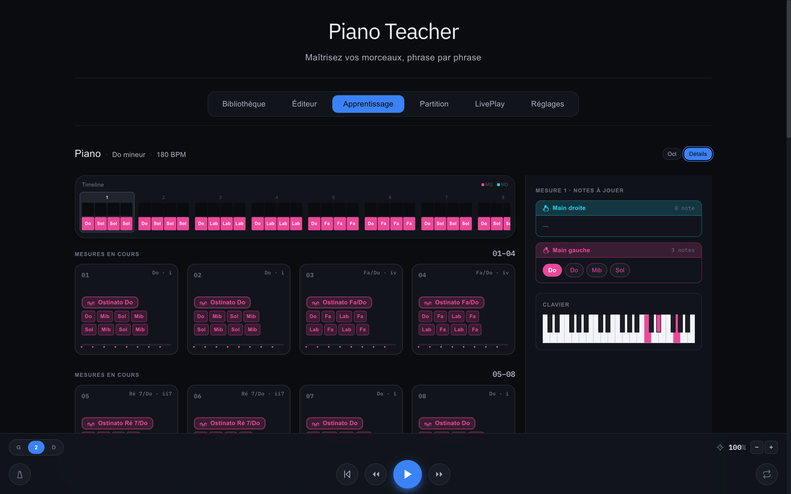
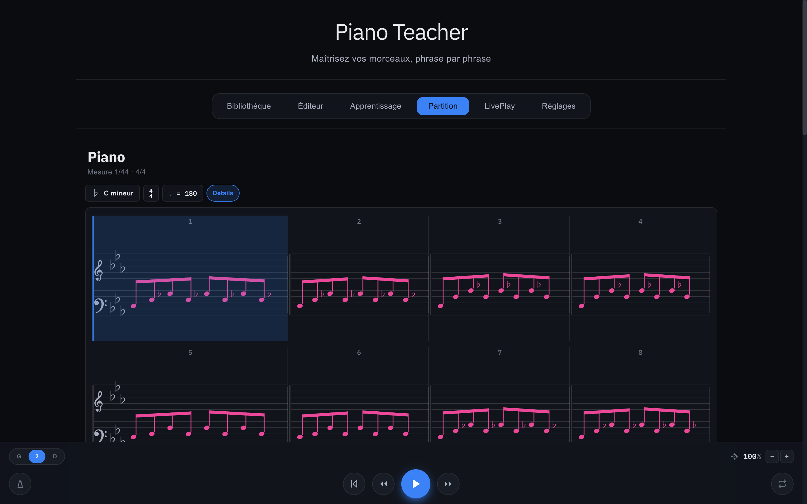
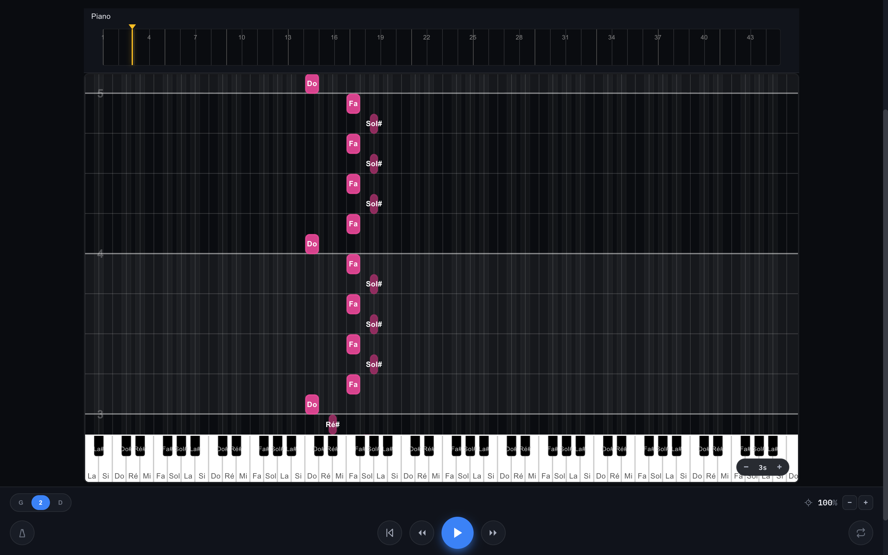

<p align="center">
  
</p>

<h1 align="center">Piano Teacher</h1>

<p align="center">
  <strong>Maîtrisez vos morceaux, phrase par phrase.</strong><br/>
</p>

<p align="center">
  <a href="https://tobietheunknown.github.io/PianoTeacher/">🌐 Site</a> ·
  <a href="https://tobietheunknown.github.io/PianoTeacher/app/">▶️ Version Web</a> ·
  <a href="https://github.com/TobieTheUnknown/PianoTeacher/releases/latest">⬇️ Télécharger (Mac / Android)</a>
</p>

---

<p align="center">
  
</p>

## Qu'est-ce que c'est ?

Piano Teacher découpe vos morceaux MIDI en **phrases et mesures**, les analyse, et **nomme ce que vous jouez** : un accompagnement répété devient un *Ostinato Do*, une basse tenue une *Pédale Ré · 8va*, chaque mesure affiche son **degré harmonique** (i, iv, VI…) en filigrane. On retient mieux ce qu'on sait nommer.

## Les trois modes

| Mode | Ce qu'il fait |
|---|---|
| **Apprentissage** | Cartes mesure par mesure : badges de motifs (ostinato, pédale), notes groupées par cycle, harmonie et degré, clavier repère |
| **Partition** | Gravure lisible : armure, chiffrage de mesure, ligatures des croches/doubles, altérations enharmoniques justes selon la tonalité (Mib, pas Ré#, en Do mineur) |
| **LivePlay** | Notes tombantes synchronisées à l'horloge audio, latence son/image calibrable, clavier MIDI branché en USB |

Et autour : un **éditeur** piano-roll, une **bibliothèque** (import MIDI), un **éditeur de thèmes** complet, un métronome, des boucles de travail.

<p align="center">
  
  
</p>

## Installer

| Plateforme | Comment |
|---|---|
| **Web** | Rien à installer : [ouvrir l'app](https://tobietheunknown.github.io/PianoTeacher/app/) — vos morceaux restent dans votre navigateur |
| **Mac** (Apple Silicon) | [`PianoTeacher-macOS.zip`](https://github.com/TobieTheUnknown/PianoTeacher/releases/latest/download/PianoTeacher-macOS.zip) — dézippez, glissez dans Applications. Premier lancement : clic droit → Ouvrir (app non notarisée) |
| **Android** | [`PianoTeacher-Android.apk`](https://github.com/TobieTheUnknown/PianoTeacher/releases/latest/download/PianoTeacher-Android.apk) — autorisez les sources inconnues puis installez |

## Architecture

Deux applications natives qui partagent le même design et la même pédagogie :

```
PianoTeacher/
├── web/        React 19 + Vite + Tone.js — l'app web, empaquetée en app Mac via Tauri 2
│   └── src-tauri/
├── android/    App native Kotlin / Jetpack Compose (audio temps réel via Oboe)
└── landing/    Site vitrine statique (GitHub Pages)
```

- **Design tokens** : `web/src/styles/tokens.css` est la source de vérité ; `android/.../ui/theme/Theme.kt` la reflète.
- **Moteur de rendu partition** : `web/src/utils/sheetMusic.js` fait référence ; le renderer Compose s'y aligne constante par constante.
- **Synchro** : tout le timing LivePlay est ancré sur l'horloge audio (`Tone.now()`), avec un offset audio/visuel calibrable par un assistant de taps dans les Réglages.

## Développer

```bash
# Web (port 8322)
cd web && npm install && npm run dev

# App Mac
cd web && npx tauri build --bundles app

# Android (JDK 17 requis)
cd android && JAVA_HOME=/path/to/jdk-17 ./gradlew :app:assembleDebug
```

Un corpus MIDI de test vit dans `web/docs/` (Departure, Other Promise, Halleluah, Laputa…) le tout arrangé par [@Jotabe](https://www.twitch.tv/jotabemusique).

J'ai commencé a build l'app (et je continuerai) en parallèle du suivi de ses cours sur [twitch](https://www.twitch.tv/jotabemusique), l'app n'est donc pas parfaite et correspond surtout a mes usages (je ne l'ai pas testée sur des miliers de fichiers midi).

---

<p align="center">© 2026 Piano Teacher — fait avec 🎹</p>
