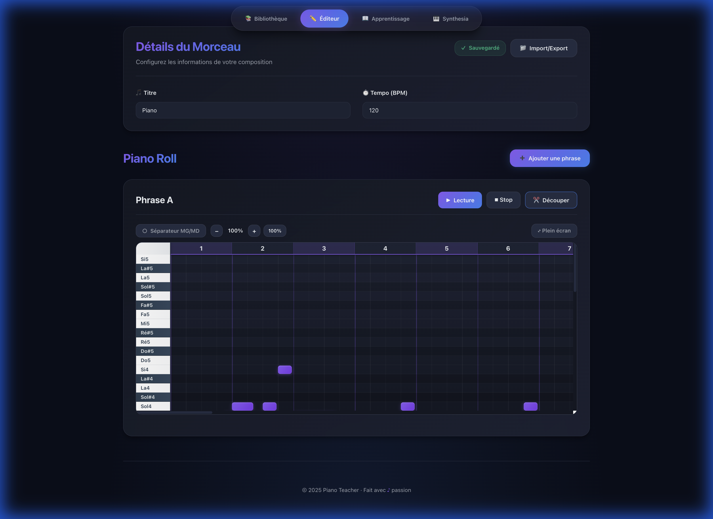
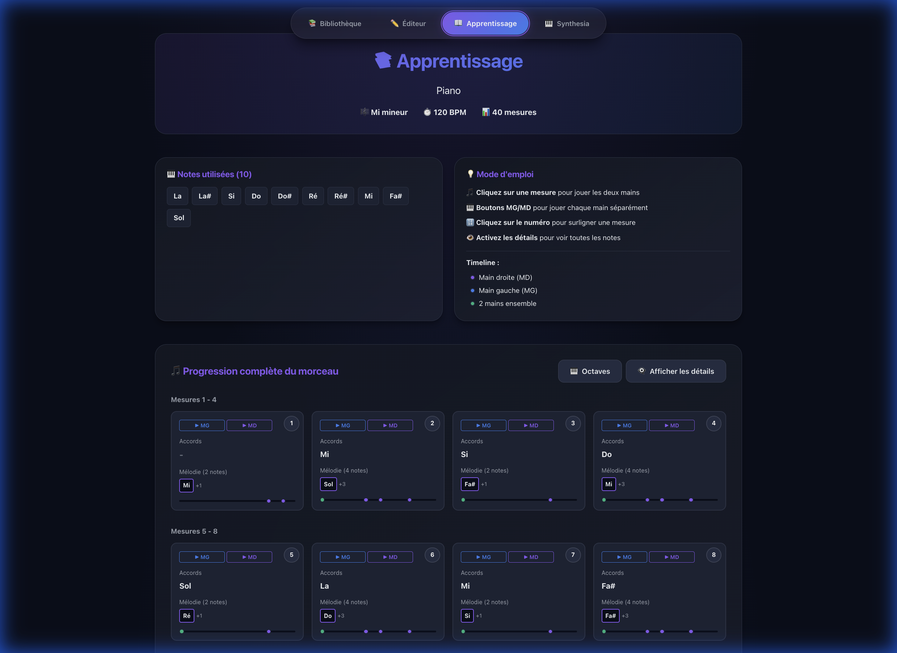
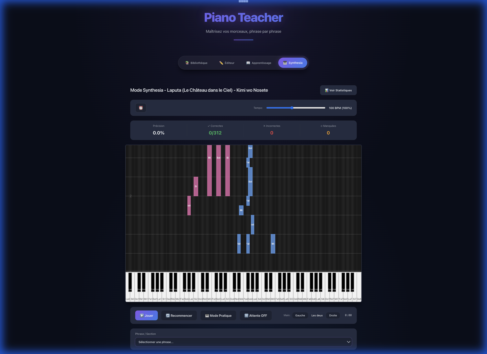

# 🎹 Piano Teacher

**Version 1.0.0**

Piano Teacher est une application web interactive d'apprentissage du piano qui transforme vos fichiers MIDI en outils pédagogiques visuels et interactifs.


## ✨ Fonctionnalités

### 📚 Bibliothèque de Morceaux (Dashboard)
- Interface moderne avec **Glassmorphism** et effets de surbrillance
- Gestion complète : créer, importer, et supprimer des morceaux
- Affichage des métadonnées (tonalité, tempo, nombre de mesures)
- Persistance locale sécurisée

### ✏️ Éditeur (Piano Roll)
- **Import MIDI intelligent** : Conversion automatique des fichiers `.mid` en séquences de notes
- **Séparation MG/MD** : Algorithme de séparation automatique basé sur le pitch pour isoler la main gauche et la main droite
- **Édition de phrases** : Découpage du morceau en sections d'apprentissage (Intro, Refrain, etc.)
- **Interaction temps réel** : Visualisation claire sur une grille de piano roll professionnelle



### 📖 Apprentissage (Vue d'Ensemble)
- **Progression visuelle** : Vue mosaïque de toutes les mesures du morceau
- **Analyse harmonique** : Détection des accords et de la complexité mélodique par mesure
- **Filtrage par main** : Choisissez de travailler la Main Gauche, la Main Droite ou les deux
- **Surlignage intelligent** : Marquez les mesures à retravailler, sauvegardé automatiquement
- **Affichage et lecture par mesure** : Cliquez sur n'importe quelle mesure pour l'écouter individuellement et l'étudier en détail



### 🎹 Mode Synthesia
- **Immersion totale** : Visualisation des notes tombantes vers un clavier virtuel
- **Code couleur dynamique** : Bleu pour la main droite, Rose pour la main gauche
- **Contrôle du tempo** : Ralentissez la lecture pour apprendre à votre rythme
- **Suivi de précision** : Statistiques en temps réel sur les notes jouées et manquées



## 🚀 Installation

### Option 1 : Télécharger l'Application (Recommandé)

**La façon la plus simple d'utiliser Piano Teacher est de télécharger l'application pour votre système d'exploitation.**

👉 **[Télécharger la dernière version](https://github.com/TobieTheUnknown/Piano/releases/latest)**

#### Windows
- Téléchargez `Piano Teacher_1.0.0_x64-setup.exe`
- Double-cliquez pour installer
- L'application sera ajoutée à votre menu Démarrer

#### macOS
- Téléchargez `Piano Teacher_1.0.0_universal.dmg`
- Double-cliquez pour ouvrir le DMG
- Glissez Piano Teacher vers le dossier Applications
- Compatible Intel ET Apple Silicon (M1/M2/M3)

#### Linux
- **AppImage** (recommandé) : `piano-teacher_1.0.0_amd64.AppImage`
  ```bash
  chmod +x piano-teacher_1.0.0_amd64.AppImage
  ./piano-teacher_1.0.0_amd64.AppImage
  ```
- **DEB** (Ubuntu/Debian) : `piano-teacher_1.0.0_amd64.deb`
  ```bash
  sudo dpkg -i piano-teacher_1.0.0_amd64.deb
  ```

---

### Option 2 : Installation depuis le Code Source

Pour les développeurs qui souhaitent modifier ou contribuer au projet.

#### Prérequis

1. **Node.js & NPM** - [Télécharger](https://nodejs.org/) (version LTS recommandée)
2. **Git** - [Télécharger](https://git-scm.com/)

#### Installation

```bash
# Cloner le repository
git clone https://github.com/TobieTheUnknown/Piano.git
cd Piano

# Installer les dépendances
npm install

# Lancer en mode développement
npm run dev
```

L'application sera accessible sur `http://localhost:5173`

#### Construire vos Propres Exécutables

Voir [BUILD_INSTRUCTIONS.md](BUILD_INSTRUCTIONS.md) pour des instructions détaillées.

```bash
# Installer Rust (requis pour Tauri)
curl --proto '=https' --tlsv1.2 -sSf https://sh.rustup.rs | sh

# Build pour votre plateforme
npm run tauri:build
```

## 📖 Utilisation

### 1. Créer un nouveau morceau
1. Cliquez sur "➕ Nouveau Morceau" dans la bibliothèque
2. Entrez le titre, l'artiste, la tonalité et le tempo
3. Importez un fichier MIDI ou créez manuellement vos phrases

### 2. Importer un fichier MIDI
1. Dans l'éditeur, cliquez sur "📁 Importer MIDI"
2. Sélectionnez votre fichier `.mid`
3. L'application détecte automatiquement :
   - La tonalité
   - Le tempo
   - Les notes de mélodie (main droite)
   - Les accords (main gauche)

### 3. Organiser en phrases
1. Ajoutez des sections : Intro, Couplet, Refrain, etc.
2. Chaque phrase affiche ses mesures avec mélodie et accords
3. Modifiez, ajoutez ou supprimez des notes selon vos besoins

### 4. Pratiquer
- **Apprentissage** : Mode détaillé pour travailler mesure par mesure avec lecture audio
- **Live Learning** : Vue d'ensemble pour planifier votre pratique et identifier les passages difficiles

## 🏗️ Architecture du Projet

```
Piano/
├── public/               # Fichiers statiques
│   └── midi/            # Fichiers MIDI d'exemple
├── src/
│   ├── components/      # Composants React
│   │   ├── Layout.jsx           # Structure principale
│   │   ├── SongLibrary.jsx      # Bibliothèque
│   │   ├── SongEditor.jsx       # Éditeur
│   │   ├── SongViewer.jsx       # Vue Apprentissage
│   │   └── LiveLearning.jsx     # Vue Live Learning
│   ├── models/          # Modèles de données
│   │   └── song.js              # Structure Song/Phrase/Note
│   ├── services/        # Services métier
│   │   ├── MidiService.js       # Parser MIDI
│   │   ├── StorageService.js    # Persistance localStorage
│   │   └── audioEngine.js       # Lecture audio (Tone.js)
│   ├── useSong.js       # Hook custom de gestion d'état
│   ├── App.jsx          # Composant racine
│   ├── main.jsx         # Point d'entrée
│   └── index.css        # Styles globaux
├── package.json
├── vite.config.js
└── README.md
```

## 🛠️ Technologies Utilisées

### Frontend
- **React 19** - Framework UI
- **Vite** - Build tool et dev server

### Audio & MIDI
- **Tone.js** - Synthèse audio et lecture
- **@tonejs/midi** - Parser de fichiers MIDI

### Stockage
- **LocalStorage API** - Persistance navigateur

### Styling
- **CSS moderne** - Variables CSS, Grid, Flexbox
- **Design responsive** - Adapté desktop et mobile

## 🎨 Fonctionnalités Techniques

### Parsing MIDI Intelligent
- Détection automatique de la tonalité par analyse des altérations
- Séparation intelligente main gauche/main droite basée sur le pitch
- Correction de précision flottante pour les notes aux frontières de mesures
- Support des fichiers MIDI multipistes

### Gestion d'État Robuste
- Hook personnalisé `useSong` pour centraliser la logique
- Sauvegarde automatique après chaque modification
- Gestion des IDs uniques avec crypto.randomUUID()
- Validation des données avant persistance

### Performance
- Rendu optimisé avec React
- Lazy loading des composants
- Build optimisé avec Vite
- Synthèse audio efficace avec Tone.js

## 🐛 Corrections Notables (v1.0)

### Fix des Notes aux Frontières de Mesures
**Problème** : Les notes tombant exactement sur les temps 4.0, 8.0, etc. apparaissaient dans la mauvaise mesure en raison d'erreurs de précision flottante.

**Solution** :
- Arrondi à 3 décimales dans `MidiService.js` lors du parsing
- Utilisation d'un epsilon (0.001) pour les comparaisons de temps dans `SongViewer.jsx`
- Tests avec plusieurs fichiers MIDI pour validation

### Persistance des Highlights
Les mesures surlignées dans Live Learning sont maintenant sauvegardées et restaurées lors du rechargement du morceau.

### Affichage Multi-Accords
Correction de l'affichage pour montrer TOUS les accords d'une mesure, pas seulement le premier.

## 📝 Roadmap Future

### Fonctionnalités Envisagées
- [ ] Export en PDF de partitions
- [ ] Métronome intégré avec accent sur le temps fort
- [ ] Mode entraînement avec répétition de boucles
- [x] Ralentissement/accélération du tempo
- [ ] Enregistrement et playback des performances
- [ ] Partage de morceaux via URL
- [ ] Support clavier MIDI physique (Connectivité directe)
- [ ] Annotations et doigtés
- [x] Statistiques de pratique (Précision Synthesia)

## 🤝 Contribution

Les contributions sont les bienvenues ! Pour contribuer :

1. Fork le projet
2. Créez une branche pour votre fonctionnalité (`git checkout -b feature/AmazingFeature`)
3. Committez vos changements (`git commit -m 'Add some AmazingFeature'`)
4. Push vers la branche (`git push origin feature/AmazingFeature`)
5. Ouvrez une Pull Request

### Guidelines
- Suivre les conventions de code existantes
- Ajouter des tests pour les nouvelles fonctionnalités
- Mettre à jour la documentation si nécessaire
- S'assurer que le build passe (`npm run build`)

### Créer une Release

Pour les mainteneurs souhaitant publier une nouvelle version, consultez [RELEASE.md](RELEASE.md) pour le guide complet de création de releases.

## 📄 Licence

Ce projet est sous licence MIT. Voir le fichier `LICENSE` pour plus de détails.

## 👤 Auteur

**TobieTheUnknown**
- GitHub: [@TobieTheUnknown](https://github.com/TobieTheUnknown)

## 🙏 Remerciements

- [Tone.js](https://tonejs.github.io/) - Pour la synthèse audio
- [@tonejs/midi](https://github.com/Tonejs/Midi) - Pour le parsing MIDI
- [React](https://react.dev/) - Pour le framework UI
- [Vite](https://vitejs.dev/) - Pour l'expérience de développement
- [Jotabe](https://www.twitch.tv/jotabemusique) - Pour l'envie de m'y mettre et les cours de piano

---

**Note** : Cette application fonctionne entièrement dans le navigateur. Aucune donnée n'est envoyée vers un serveur externe. Toutes vos données sont stockées localement sur votre appareil.

🎵 **Bon apprentissage du piano !** 🎹
